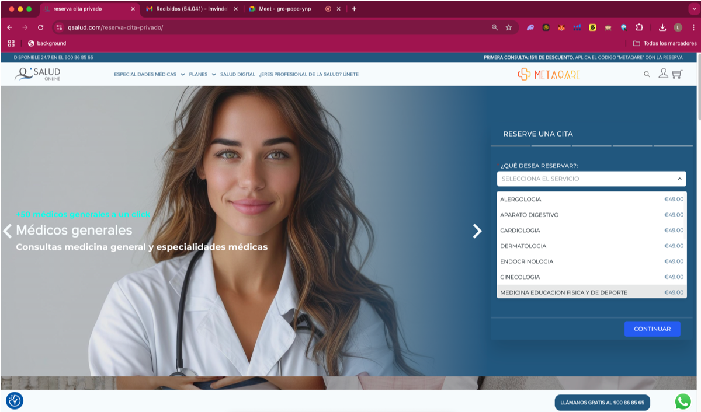
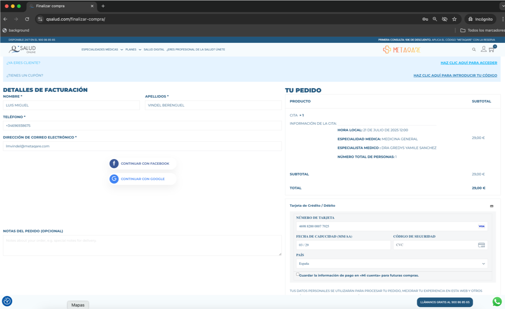
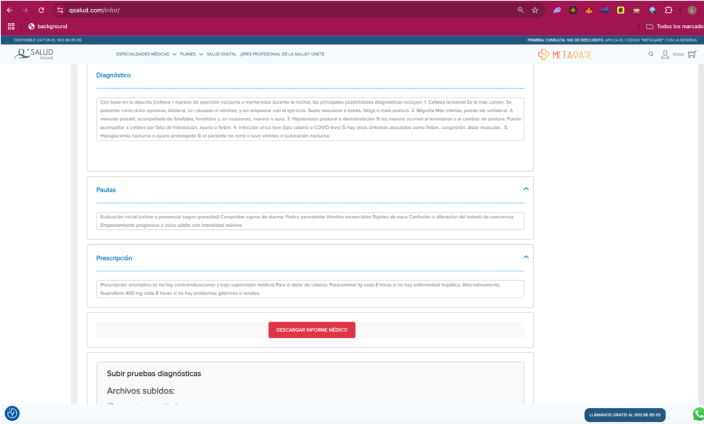
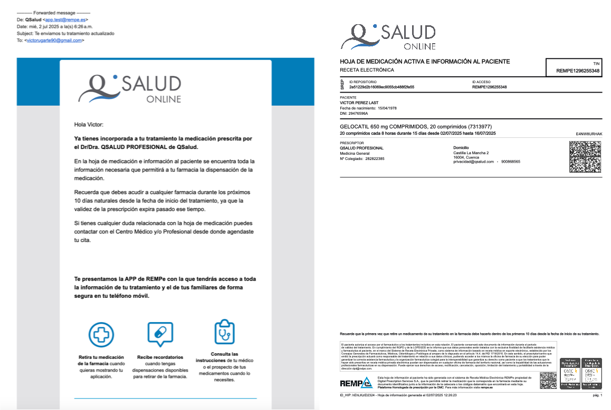

# Manual del Paciente / Asegurado | MetaQare

El presente manual tiene como objetivo ofrecer una guía detallada, estratégica y pedagógica sobre cómo un paciente o asegurado puede navegar, beneficiarse y sacar el máximo provecho de la infraestructura digital MetaQare, desplegada en aplicaciones como Qsalud. MetaQare no es una app más: es un ecosistema diseñado desde la evidencia clínica, los datos, y la tecnología de vanguardia para que el paciente recupere el control de su salud con autonomía, seguridad y acompañamiento profesional.

## Acceso al Ecosistema MetaQare

MetaQare está diseñado para ofrecer accesibilidad desde cualquier entorno y dispositivo. El acceso se realiza principalmente desde: 
•	Portal web: https://qsalud.com 
•	Dispositivos móviles (web responsive) 
•	Enlaces directos desde aseguradoras colaboradoras (ej. MAPFRE Salud) 
Una vez dentro del sistema, el usuario podrá elegir entre navegar por su cuenta o dejarse guiar por el Asistente Inteligente de Triaje, que constituye uno de los pilares tecnológicos diferenciales del ecosistema. 
"El 70% de los usuarios en Europa esperan una experiencia digital fluida y comparable a la de Amazon o Netflix, también en salud." — McKinsey HealthTech Survey 2023

...

## Triaje Inteligente y Personalización del Servicio

Una de las innovaciones diferenciales de MetaQare es la automatización del triaje clínico mediante IA. Este agente IA: 
•	Formula preguntas adaptadas a los síntomas descritos. 
•	Evalúa nivel de urgencia y necesidad de derivación. 
•	Sugiere la especialidad médica más adecuada. 
•	Recomienda canal de atención (videollamada, llamada, mensajería). 
•	Prioriza disponibilidad según urgencia y preferencias horarias. 
Este enfoque permite reducir tiempos de espera, mejorar la asignación de recursos y aumentar la satisfacción del paciente desde el primer minuto. 
“Los asistentes IA permiten ahorrar hasta un 35% del tiempo total en la experiencia de primera atención médica.” — HIMSS Digital Care Report, 2024

 
...

## Selección de Consulta y Profesional

Los pacientes que prefieren una navegación directa pueden: 
•	Elegir entre modalidad privada, aseguradora o empresarial. 
•	Seleccionar la especialidad entre más de 30 disponibles. 
•	Filtrar por profesional médico (nombre, sexo, idioma, valoraciones). 
•	Indicar si desean el primer disponible o agendar con antelación. 
En modelos como Qsalud, se permite además la reserva de múltiples consultas en un solo flujo, lo cual es especialmente útil en contextos familiares o pacientes crónicos.

...

## Agendamiento Multicanal

La experiencia de calendario es intuitiva y multicanal: 
•	Interfaz con calendario personalizable. 
•	Confirmación por email, SMS o WhatsApp. 
•	Enlace directo a Google Calendar para integración personal.  
El sistema también gestiona automáticamente: 
•	Recordatorios 24h antes de la cita. 
•	Posibilidad de reprogramación sin penalización. 
“Una agenda médica con recordatorios automáticos reduce en un 41% la tasa de ausencias médicas (no-shows).” — Harvard Business Review, 2022

...

## Proceso de Pago Seguro

En consultas privadas, MetaQare integra pasarelas seguras (Redsys, Stripe) con validación bancaria europea. 
•	Visualización anticipada de precios y duración estimada. 
•	Pago por tarjeta sin comisiones ocultas. 
•	Recepción inmediata de: 
o	Factura fiscal 
o	Acceso a la plataforma del paciente 
o	Confirmación de cita por email/WhatsApp 
Para pacientes asegurados, el sistema valida automáticamente la cobertura con SEOGA o API propia.

...

## Área Personal del Paciente

El área privada del paciente está diseñada con enfoque en usabilidad y autonomía: 
•	Historial de citas pasadas y próximas. 
•	Informes clínicos descargables. 
•	Recetas médicas activas. 
•	Comunicación asincrónica con el profesional. 
•	Visualización de contenidos educativos y consejos. 
•	Asistente IA accesible 24/7. 
Cada paciente tiene control total sobre su información, cumpliendo los principios de autodeterminación sanitaria (Ley 41/2002 y RGPD).

...

## Videoconsulta Avanzada

MetaQare permite acceder desde cualquier navegador moderno o dispositivo móvil sin necesidad de instalar apps. 
Características: 
•	Videollamada médica cifrada 
•	Chat clínico y de soporte 
•	Fondos personalizables 
•	Compartición de documentos e imágenes 
•	Control de calidad de audio y video previo 
“El 94% de los usuarios de salud digital en España consideran esencial que la videollamada esté cifrada de extremo a extremo.” — FENIN, 2023

...

## Informes e Historial Clínico

Tras cada consulta, el sistema genera un informe médico estándar que: 
•	Resume el motivo de consulta, diagnóstico y tratamiento 
•	Puede incluir recomendaciones, alertas, y seguimiento 
•	Está disponible en PDF para descarga inmediata 
Se conserva bajo protección legal durante el plazo estipulado en normativa europea y autonómica.

...

## Receta Electrónica y REMPE

MetaQare está homologado para emitir recetas electrónicas a través de la red REMPE (Receta Electrónica Privada de España). 
El proceso es: 
1.	El médico prescribe desde la plataforma. 
2.	El paciente recibe notificación. 
3.	Acude a la farmacia con su DNI o código QR. 
4.	El farmacéutico accede automáticamente a la medicación activa. 
Incluye hoja de información terapéutica, trazabilidad y derechos de acceso.

...

## Asistente Médico IA 24/7

El paciente puede activar el asistente en cualquier momento para: 
•	Resolver dudas frecuentes 
•	Obtener explicaciones de síntomas comunes 
•	Solicitar consejo de especialidad 
•	Acceder a enlaces de contenido avalado 
Además, el sistema puede alertar automáticamente de síntomas compatibles con urgencias y ofrecer derivación directa.

...

## Validación con Aseguradoras

Cuando el usuario selecciona una aseguradora: 
•	Se solicitan los datos del asegurado. 
•	El sistema consulta en tiempo real la cobertura. 
•	Se filtran las especialidades disponibles. 
•	El profesional recibe la validación ya hecha antes de iniciar la consulta. 
Esto elimina el 100% del papeleo para el paciente.

...

## Privacidad y Seguridad

•	Encriptación AES-256 en tránsito y reposo. 
•	Firma electrónica avanzada eIDAS. 
•	Control de logs, acceso, y consentimiento informado automático. 
•	Infraestructura sobre AWS Europa con redundancia geográfica. 
MetaQare cumple con ENS, RGPD, LOPDGDD y está auditado externamente.

...

## Soporte Integral

•	Línea 24/7 para soporte técnico y médico: 900 868 565 
•	Email institucional: info@qsalud.com 
•	WhatsApp de soporte (pacientes): +34 696 938 675 
________________________________________
MetaQare pone al paciente en el centro del ecosistema digital. Porque la salud conectada no es el futuro: es el presente. Seguro. Inteligente. Universal.

...
