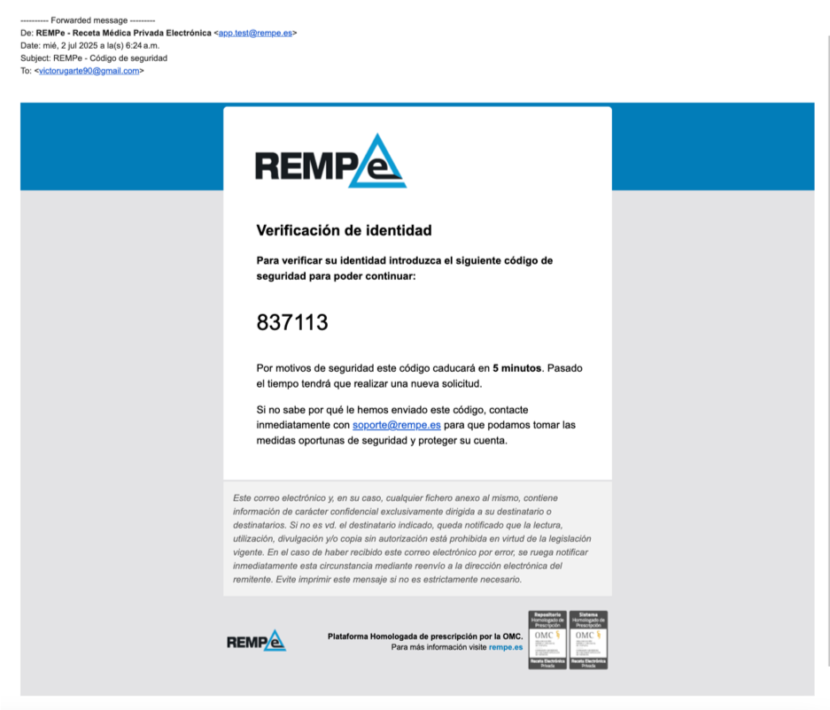

# Manual del Profesional Médico | MetaQare

Este manual proporciona a los profesionales médicos una guía práctica y estratégica para utilizar MetaQare como plataforma clínica centralizada. Diseñado para médicos que operan en el entorno digital (ya sea en red Qsalud o integrados desde aseguradoras), este ecosistema combina agilidad, trazabilidad clínica y eficiencia operativa a través de IA, blockchain y videomedicina.
...

## Acceso e Inicio de Sesión

•	Acceso desde: https://qsalud.com o URL institucional personalizada  
•	Inicio de sesión mediante email o cuenta federada (Google/Facebook) 
•	Sistema de autenticación de doble factor (2FA) para firma de recetas y documentos 

...

## Configuración de Perfil Médico

Una vez dentro del sistema, el médico puede configurar: 
•	Datos personales y profesionales 
•	Número de colegiado, especialidad y subespecialidades 
•	Documentación obligatoria: seguro de responsabilidad civil, certificados 
•	Idiomas, disponibilidad horaria y preferencias de consulta 
MetaQare garantiza que solo médicos habilitados y colegiados acceden a la funcionalidad clínica avanzada. 

...

## Gestión de Agenda y Disponibilidad

Desde el panel de configuración: 
•	Definición de horarios semanales y excepciones (festivos, bloqueos) 
•	Personalización por modalidad: videollamada, telefónica o chat 
•	Activación o desactivación de fechas especiales 
El sistema sincroniza la agenda automáticamente con las citas agendadas desde el portal del paciente o desde aseguradoras integradas. 

...

## Panel de Control Médico

Desde el panel principal, el profesional accede a: 
•	Visión general de todas las consultas (hoy, semana, mes) 
•	Estado de cada consulta: completada, cancelada, pendiente, no presentada 
•	Ingresos generados y pagos procesados (segmentados por compañía o canal) 
•	Estadísticas personales (NPS, tiempo medio de consulta, especialidades más frecuentes) 
“El 65% de los médicos en Europa consideran que su sistema actual digital está fragmentado y poco eficiente” — McKinsey Health Systems Report, 2023

...

## Portal de Videoconsulta

Cada consulta se ejecuta desde un entorno clínico virtual con: 
•	Chat médico/paciente y posibilidad de chat interno (coordinadores, especialistas) 
•	Videollamada encriptada con opción de compartir documentos en tiempo real 
•	Acceso inmediato a la historia clínica del paciente 
•	Generación automática del informe clínico (editable) 
•	Posibilidad de transferir la consulta o escalar a segundo nivel  
MetaQare incorpora un Asistente IA Clínico que: 
•	Resume automáticamente historias clínicas largas 
•	Sugiere alertas clínicas o contraindicaciones 
•	Propone tratamientos estándar validados 

...

## Prescripción y Receta Electrónica (REMPE)

•	Receta electrónica homologada para prescripción inmediata 
•	Integración con REMPE (plataforma nacional de receta electrónica privada) 
•	Envío automático al paciente tras la firma digital 
•	Generación de hoja de medicación activa en PDF 
•	Firma electrónica avanzada eIDAS 
“La automatización de la receta médica reduce en un 60% los errores de transcripción y mejora la adherencia terapéutica” — Deloitte eHealth Europe, 2024

...

## Informes Médicos Inteligentes

•	Plantilla configurable por especialidad  
•	Prellenado automático con IA generativa (editable por el médico)  
•	Firma y archivo en el historial clínico  
•	Descarga inmediata por el paciente  

...

## Gestión de Ingresos y Remuneración

Cada médico dispone de un espacio donde:  
•	Se visualizan sus ingresos por acto médico, compañía y mes  
•	Se consulta el estado de pagos (abonado, pendiente, programado)  
•	Puede descargar justificantes para IRPF y autónomos    
Para médicos en red Qsalud, el sistema muestra también:  
•	Citas asignadas automáticamente  
•	Ingresos variables por rendimiento (KPI)  

...

## Indicadores de Desempeño Profesional (KPI)

•	NPS promedio mensual (valoración paciente)  
•	Tiempo medio por consulta  
•	% de resolución sin derivación  
•	% de seguimiento programado  
•	Ratio de asistencia efectiva vs ausencias  

...

## Seguridad y Buenas Prácticas Clínicas

•	Firma electrónica solo habilitada con número verificado  
•	Acceso restringido a médicos con documentación validada  
•	Historial clínico trazable, con logs firmados  
•	Consentimientos automáticos registrados por paciente  

...

## Soporte y Formación Continua
•	Guías interactivas dentro del portal  
•	Canal de soporte 24h para incidencias técnicas o clínicas  
•	Webinars mensuales con actualización clínica y normativa  
•	Acceso a equipo médico coordinador para resolución de casos  

...

MetaQare ofrece al médico digital un entorno clínico único, eficiente y trazable. Porque el futuro de la medicina empieza con herramientas a la altura del profesional.
